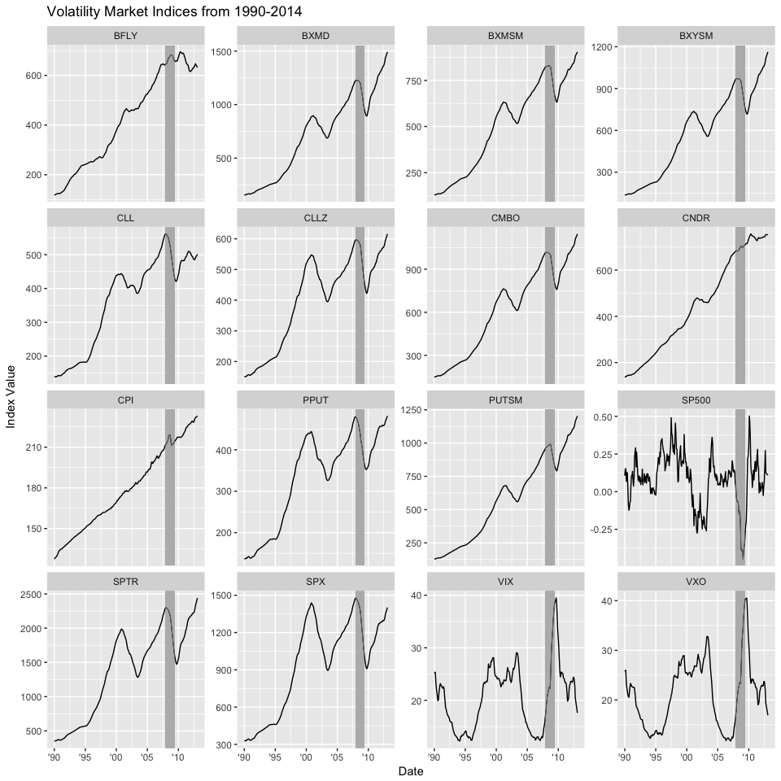
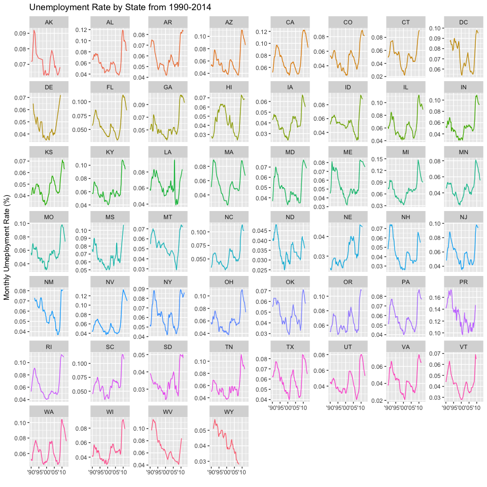
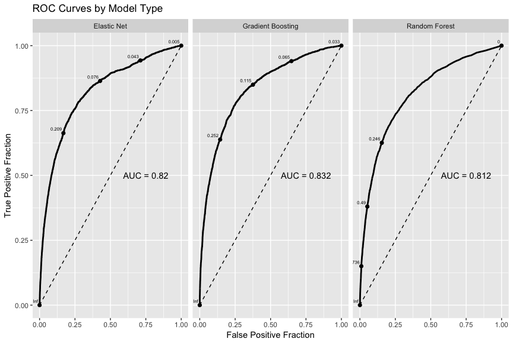
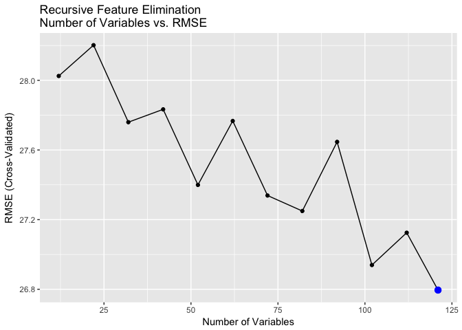
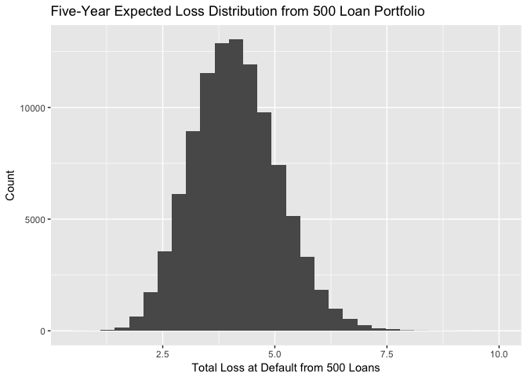
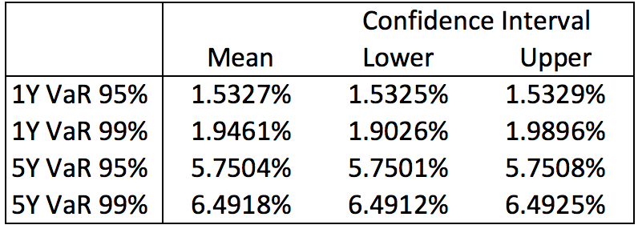
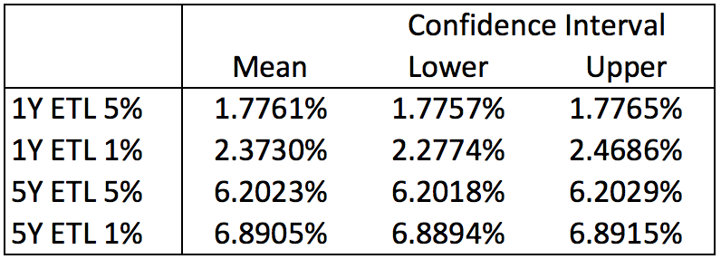
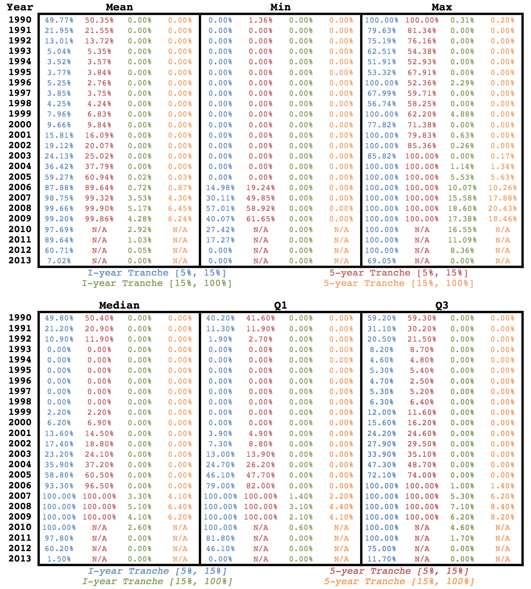

# MS&E 246 Final Report
Samuel Hansen, Theo Vadpey, Alexandre Elkrief, Ben Etringer  
3/23/2017  

#Exectutive Summary

In *MS&E 246: Financial Risk Analytics*, our team analyzed a data set of 
roughly 150,000 loans backed by the US Small Business Administration 
(SBA) between 1990 and 2014. In doing so, we aimed to implement and test models
of the risk and loss of loan default. This report summarizes our findings from 
exploratory data analysis, details our approaches to modeling loan 
default probability and loss, and presents our methods of estimating
the loss distributions of tranches backed by a portfolio of loans. 

#Exploratory Data Analysis

Prior to model building, we explored the data to detect patterns that may 
provide signal for models of loan default. Because we first aimed to build 
binary response models of default probability, we excluded "Exempt" loans from 
our exploratory analysis. When we fit survival models (see *Cox proportional hazards models section*), "Exempt" loans were reintroduced into the population under consideration as right-censored observations. Thus, all patterns from
exploratory data analysis apply to paid and  defaulted loans, not "Exempt" ones. Subsequently, we examined the relationship between default rates and the predictor variables, including `Business Type`, 
`Loan Amount`, `NAICS Code`, and `Subprogram Type`, among others. 

Further, we collected additional predictor variables such as monthly 
`GDP`, `Crime Rate`, and `Unemployment Rate` by State, as well as macroeconomic
predictors such as monthly measures of the `S&P 500`, `Consumer Price Index`, 
and 14 other volatility market indices. 

Importantly, time-indexed data were joined on each loan's approval date. 
For example, when we discuss the crime rate associated with a given loan, we mean the crime rate at the time the loan was approved. Thus, these quantities are known and fixed for a given loan at its approval date (see *Feature Engineering* section for further details).

##Default Rate vs. Business Type 

First, we examined the relationship between default rate and `Business Type`
by loan approval year. As shown on the plot below, we observe an interaction
effect between these three features, such that default rates spiked for 
loans that were approved around the Great Recession (approximately 2007-2009). 
Further, the different trajectories of the 3 curves implies the "Individual" 
`Business Type` suffered greater default rates than corporations and 
partnerships. Although corporations constitute a greater share of the data set,
as evidenced by the greater mass in the red circles, they exhibit medium 
default risk, as compared to the other business types. Taken together, 
this plot reveals business types were affected differently by the recession,
offering useful signal for subsequent modeling. 

<!-- -->

##Default Rate by Loan Amount

Second, we examined whether we would observe a similar time-dependent 
interaction effect between default rate and `Loan Amount`. The plot below 
reveals that loans of all sizes approved around the Great Recession faced the
greatest default rates. However, loans of sizes \$500k-\$1m and \$1m-\$2m
appear to have experienced larger default rates over time compared to smaller
loans of size \$100k-\$300k and \$300k-\$500k. The spiking behavior of \$1m-\$2m
loans in 1999 and of loans greater than \$2m seem to be due to small sample 
sizes, as depicted by circle diameter. Overall, since loans of different sizes
have different default rate patterns over time, we would also expect 
the `Loan Amount` feature to offer predictive power. 

<!-- -->

##Default Rate by NAICS Code

Third, we hypothesized different economic sectors would exhibit 
different default rates over time. In turn, we extracted the North American 
Industry Classification System (NAICS) code for each loan and truncated it
to the first two digits, which represents broad industry classes such as 
"Agriculture" and "Manufacturing." The following plot shows the default 
rate for loans of each truncated NAICS code approved in each year between 
1990-2014. We observe considerable variance in default rates between sectors;
for instance, code 72, corresponding to "Accommodation & Food Services", 
has one of the highest default rates even before the recession. However,
code 54, corresponding to "Professional, Scientific, and Technical Services,"
consistently has one the lowest default rates. These patterns are consistent
with intuition, and underscore the value of including the truncated NAICS code
as a predictive feature of defaulting. 

<!-- -->

##Default Rate by Subprogram Type

Fourth, we compared the default rates between different loan subprogram types. 
The plot below shows the default rates of the different loan
subprograms versus their respective counts in the data. We observe 
that the PSF subprogram is the most common and has medium default risk. 
However, loans in the Premier Certified Lenders Program (PCLP) are less 
common, but have higher default risk. This suggests `Subprogram Type` offers 
useful signal for predicting default risk. Lastly, the loans belonging to the 
Delta and Refinance subprograms are highly uncommon and have low default risk. 
In order to reduce to the dimensionality of the feature space, we collapsed 
these two factor levels into "Other."

<!-- -->

##Volatility Indices

In addition to visualizing loan default risk for variables in the provided data,
we also examined how volatility market indices fluctuated from 1990-2014.
Visualizing such time-varying patterns can yield insight into how various 
indices behave as macroeconomic indicators of risk. The following plot includes 
these indices, as well as the S&P 500 and Consumer Price Index (CPI) (see *Data Cleaning* section for data collection details). Further, the official
period of the Great Recession (December 2007 - June 2009) is highlighted in grey. This plot acts as a sanity check for data quality; for instance, `VIX` and `VXO`, which both capture market volatility, spike during the recession. Further, the S&P 500 plummets, and the CPI spikes despite its gradual rise. Many other volatility market indices, which are labeled by their abbreviations, decline during the recession as well. Taken together, this plot validates our intuitions about how macroeconomic risk indicators responded to the Great Recession. 

<!-- -->

##State Unemployment Rates

Lastly, we visualized changes in unemployment rates by State
because it may also be predictive of loan default probability. As depicted 
in the figure below, nearly all States experienced sudden increases in 
unemployment rates during the recession. Interestingly, we observe
different patterns in magnitudes and rates of increase across different States.
This plot also acts as a sanity check by confirming various expectations,
including Puerto Rico's (PR) consistently higher unemployment rate, and 
Michigan's unemployment spike largely due to manufacturing layoffs during the 
recession. Such State-by-State variation may offer predictive power 
for subsequent models. 

<!-- -->

#Modeling Default Probability 

Building upon our exploratory data analysis, we constructed two types of 
predictive models of loan default probability: binary response models and 
the Cox proportional hazards model. Here, we present our approach to fitting
both model types, including data cleaning, feature engineering, 
feature selection, hyper-parameter optimization, and evaluation. 

##Binary Response Models

First, we built binary response models of small-businesses defaulting on loans,
which estimate the probability that a given loan *ever* defaults. To do so,
we implemented a machine learning pipeline that: 

1. Performs feature engineering;
2. Splits the data into train and test sets;
3. Normalizes continuous features;
4. Selects features using recursive feature elimination;
5. Trains binary response predictive models. 

Lastly, we evaluated the performance of these models on resampled partitions 
of the training data, and on a held-out test set in terms of AUC, sensitivity, 
and calibration. 

###Feature Engineering

Building on insights derived from exploratory data analysis,
we engineered the following features from the raw data: 

- `NAICS_code`: truncated to the first two digits of the NAICS code;
- `subprogram`: condensed infrequent factor levels into "other" category;
- `approval_year`: extracted year from loan approval date-time object.
- `SameLendingState`: created flag for whether borrower received loan from in-state; 
- `MultiTimeBorrower`: created flag for whether loan recipient is a multi-time borrower;
- `ThirdPartyLender` created flag for whether borrower received third party aide. 

In effect, these features represent dimensionality reduction of factors 
with many levels. For instance, there are 1,239 unique NAICS six-digit NAICS
codes in the raw data, yet only 25 unique 2-digit codes. Although we lose 
fine-grained detail by truncating the NAICS code, we aimed to optimize our
models by reducing variance introduced by high dimensionality. After applying
such dimension reductions, we eliminated extraneous variables, such as the 
Borrower's Zip Code and the Project's State, which were used to engineer
features. 

In addition to constructing features from the raw data, we also incorporated 
data from external sources, including monthly State-based measures of 
crime rate, GDP, and unemployment rate. We also joined in various risk 
factors at the time of loan approval, including monthly snapshots of the `S&P 500`, `Consumer Price Index`, 
and 14 other volatility market indices. Below is a list of the macro-economic features that we incorporated 
into our model, and their respective sources:

- GDP by State: $\textit{Bureau of Economic Analysis}$ 
- Crime Rate by State: $\textit{Uniform Crime Reporting Statistics}$
- S&P 500 Returns: $\textit{Yahoo! Finance}$
- Volatility Markets: $\textit{Yahoo! Finance}$
- Unemployment Rate by State: $\textit{Bureau of Labor Statistics}$
- Consumer Price Index by Month: $\textit{Bureau of Labor Statistics}$

###Data Splitting 

We randomly partitioned the data into 70% training and 30% test sets. 
This approach does not implement a time-based split, but rather a random 
sampling of observations over the entire 1990-2014 window. We adopted this 
splitting approach because we were interested in capturing the signal 
of the Great Recession within our models. Further, we did not create a 
validation set because we performed feature selection and hyper-parameter
optimization using cross-validation on the training set. 

###Data Preprocessing

After splitting our data, we applied several preprocessing steps to our training data frame. First, we centered and scaled the continuous predictors to apply regularization  techniques during the modeling phase. Doing so adjusted for variables being on different scales; for example, `Gross Approval` varies in dollar amounts from \$30,000  to \$4,000,000, whereas `Term in Months` ranges from 1 to 389. Second, we applied a filter to remove features with near zero variance to eliminate predictors that do not offer meaningful signal. Lastly,
we applied the same centering and scaling from the training data to the test
data.

###Feature Selection

To perform feature selection, we used recursive feature elimination
with 10-fold cross-validation. This method uses random forests to iteratively
remove variables with low variable importance, as measured by mean increase 
in out-of-bag area-under-the-curve (AUC). In other words, variables that 
do not contribute to significant improvements in AUC are eliminated. We
performed a grid search over the number of potential features to determine 
how many features to include. Note that factors were converted to separate dummy variables using a one-hot encoder. 

The following plot shows that recursive feature elimination 
chose 122 
variables because AUC is maximized (see plot below). In effect, all variables
were kept because they offered predictive power regarding loan defaults. 

<!-- -->

The importances of the top 10 selected features are shown in the plot below.
We observe that State GDP, a monthly time-dependent risk factor, is the most 
important feature, meaning it led to the greatest average increase in AUC
across cross-validation iterations. State unemployment rate and crime rate 
are also highly important, suggesting local time-dependent risk factors 
are the most predictive of whether a loan defaults. 

The importance of NAICS code 72, corresponding to 
"Accommodation & Food Services", is consistent with our exploratory 
data analysis finding that the sector is especially risk prone. Borrower States
such as Michigan, California, and Florida also offer predictive power regarding 
defaulting. Lastly, the importances of the Collar Index (CLL) and Iron 
Butterfly Index (BFLY) imply market volatility measures also improve 
the discrimination of loan defaults. 

<!-- -->

###Model Fitting 

Using these selected features, we fit models predicting the binary outcome
of whether a small business defaults on a loan. We constructed linear and 
nonlinear models, including a logistic regression model with the elastic net 
penalty, a random forest classifier, and a gradient boosting machine 
classifier. To tune hyper-parameters, we used 10-fold cross-validation with the 
one standard error rule, which selects parameters that obtain the highest 
cross-validated AUC within one standard error of the maximum. For each model
type, we performed a grid search over the hyper-parameters to ensure optimal
selection.

####Logistic Regression with Elastic Net

First, AUC was used to select the optimal logistic regression model with an
elastic net penalty using the one standard-error rule. As shown in the plot 
below, the final values used for the model were `alpha` = 0.1 and `lambda` = 0,
indicated by the spike in the red curve at `alpha` = 0.1. This implies the 
optimal model used the ridge penalty more than the LASSO penalty with minimal 
regularization. 

<!-- -->

####Random Forest Classifier

Second, AUC was used to select the optimal random forest model, which selected 
`mtry` = 8 as the best parameter. This means 8 random predictors were chosen 
to build each tree of the random forest. The plot below shows steadily declining
AUC as the number of randomly chosen predictors increases, indicating that
the optimal model is sparsest. 

<!-- -->

####Gradient Boosting Machine Classifier

Third, AUC was similarly used to select the optimal gradient boosting machine 
(GBM) model. The final values used for the model were `nrounds` = 100, 
`max_depth` = 6, `eta` = 0.03, `gamma` = 0, `colsample_bytree` = 0.4, 
`min_child_weight` = 1 and `subsample` = 0.5. This means that the tuning 
procedure utilized a learning rate of 0.03 and a minimum loss reduction of 0, 
resulting in the optimal model with 100 trees of maximum depth 6 that subsamples
50% of the observations and 40% of the features for each tree. This combination
of optimal hyper-parameters is shown by the spike of the red curve in the first 
subplot at the maximum tree depth of 6.  

<!-- -->

Examining the variable importance of the final GBM model, we observe the most 
important feature for predicting defaults is the Collar Index (CLL), which is
"designed to provide investors with insights as to how one might protect an 
investment in S&P 500 stocks against steep market declines" ([CBOE](http://www.cboe.com/products/strategy-benchmark-indexes/collar-indexes/cboe-s-p-500-95-110-collar-index-cll)). Other important features include the national 
consumer price index (CPI), State GDP, crime, and unemployment rates, 
loan amount, and Chicago Board Options Exchange (CBOE) indices including the 
Butterfly Index (BFLY), the Iron Condor Index (CNDR), and the Volatility index 
(VIX). Such variables are "important" because they lead to the greatest 
improvements to cross-validated AUC across boosting iterations. 

<!-- -->

###Model Evaluation 

After we optimized the hyper-parameters of our models, we evaluated the models  
using in-sample and out-of-sample metrics, including AUC, sensitivity,
ROC curves, and calibration. To do so, we used these "best" models to 
predict loan defaults in the training and test sets. 

####In-Sample Evaluation 

#####Training AUC and Sensitivity of Best Models 

The following plot compares averaged **training** area under the ROC curve 
and sensitivity across the model types with optimized parameters. We observe
that the gradient boosting machine classifier has the highest AUC and 
sensitivity, whereas the logistic regression model with the elastic net penalty
performs the worst. 

<!-- -->

#####Distribution of Resampled Training AUC, Sensitivity, and Specificity 

To examine the spread of **training** area under the ROC curve,
sensitivity, and specificity across model types, we leveraged the resampled
data generated during the cross-validation of model fitting to plot 
their respective distributions. In the following plot, we observe that 
the GBM classifier has the highest median AUC, sensitivity, and specificity,
as well as the smallest spread. Although the random forest classifier has 
comparable sensitivity, it exhibits enormous variance compared to the other 
models, suggesting it is prone to overfitting. For this reason, the logistic
regression classifier (a linear model) outperforms the random forest classifier
(a non-linear model) in terms of AUC and specificity. 

<!-- -->

#####Training ROC Curves 

Lastly, we can examine the **training** ROC curves by model type. 
We observe that the random forest model has a near-perfect ROC curve,
which also implies it is overfitting to the training data. The GBM model again
performs worse than the random forest model on the training data, but likely 
because it is avoiding overfitting. The logistic regression model with the 
elastic net penalty performs the worst. 

<!-- -->

####Out-of-Sample Evaluation 

#####Test ROC Curves 

We evaluated our best models on a held-out test set representing 30% of the 
original data. The ROC curves below reveal that the GBM model performed 
the best on the test set, followed by the logistic regression model, and 
lastly, the random forest classifier. The weak performance of the random forest 
classifier is likely due to overfitting on the training set. Nevertheless, 
all models achieve good performance over "random guessing" baselines. 

<!-- -->

#####Test Calibration Plots

Lastly, we evaluated the calibration of our models' predicted probabilities
of loan default against the observed fraction of defaults in the data. 
A point on the dashed line means that the model's predicted probability
of default matched the empirical default rate. Points to the right of the line 
mean the model overestimated the default probability, whereas points to the 
left mean the model underestimated the default probability. 

The GBM model achieves the best calibration because its points follow 
the dashed line most closely. The logistic regression model with the elastic net
penalty achieves comparable performance; however, the random forest classifier
tends to overestimate default probabilities. Again, this weaker performance 
is likely due to overfitting. 

<!-- -->

The overfitting of the random forest classifier may be due to the fact that 
too many features were randomly selected to build trees at each
iteration. Our hyper-parameter optimization approach performed a grid search
over possible values of `mtry`, representing the number of features 
randomly chosen to build each tree in the forest. However, our grid may have
not been large enough, since the minimum value of `mtry` was chosen. 
However, computational resources limited our ability to refit models 
over a larger search space. 

Moreover, the gradient boosting machine classifier demonstrated the best
performance on the test set in terms of AUC and calibration.  

##Cox Proportional Hazards Model 

	
Survival analysis provides more detailed information about how the default risk of a loan varies over time. With binary classification, we fit models to predict the probability that a given loan *ever* defaults. With a hazard model, we can estimate the probability that a loan defaults between any two points of time in its life.

###Model Choice

There exist many specialized Cox models that assume a particular form of the baseline hazard function. The Cox proportional hazards (PH) model does not have this requirement. We can see this in the following description of the partial maximum likelihood procedure used to estimate the parameters of the Cox PH model:

The form of the cox model is:
    $$h(t) = h_0(t)exp(\beta^T X)$$

Suppose there are $r$ observed death times in the data (all distinct), and that $t_j$ is a death time in the set of possible death times: $R = \{t_1,t_2,...,t_r\}$. 

Then the conditional probability that an individual dies at time $t_j$ given $t_j$ is a time of death in the set $R$:
     $$\frac{P(\text{individual with feature vector $X^{(j)}$ dies at $t_j$})}{P(\text{one death at $t_j$})}$$     
     $$ = \frac{ P(T = t_j | X^{(j)}, T \geq t_j ) }{P(T = t_j | X^{(k_0)}, T \geq t_j) \cup P(T = t_j | X^{(k_1)}, T \geq t_j) \cup ... P(T = t_j | X^{(k_q)}, T \geq t_j)}$$

Where $k_0, ..., k_q$ correspond to the indices of observations with event times greater than or equal to $t_j$. Since the probabilities in the denominator are *assumed to be conditionally independent*, the denominator can be expressed as a sum of probabilities. Converting the above to continuous time, we get: 

$$ = \frac{\text{lim}_{\delta \rightarrow 0}\frac{P(T < t_j + \delta | X^{(j)}, T \geq t_j )}{\delta}}{ \sum_{i = k_0}^{k_q} \text{lim}_{\delta \rightarrow 0}\frac{P(T < t_j + \delta | X^{(i)}, T \geq t_j)}{\delta} }$$

$$ = \frac{h_j(t_j)}{\sum_{i = k_0}^{k_q} h_i(t_j)} = \frac{h_0(t_j) exp(\beta^T X^{(j)})}{\sum_{i = k_0}^{k_q} h_0(t_j) exp(\beta^T X^{(i)})} = \frac{exp(\beta^T X^{(j)})}{\sum_{i = k_0}^{k_q} exp(\beta^T X^{(i)})}$$

And we can see that the contribution of any observation to the likelihood function will not be dependent on $h_0(t)$. $\square$
	      
###Modifications to the Data
**It is important to note that from this part of the project moving forward, "Exempt" loans are included.** 

First, we created a new random data split with 70% training and 30% testing sets, which include these previously excluded observations. Second, roughly 95% of loans in the training data had term lengths of 20 years. We decided that considering loans with the same term was more appropriate for this analysis (84,949 loans).\footnote{One might imagine how fitting a model to predict default probabilities $t$ years ahead on data in which most loans are of a certain term length might give misleading output when predicting on a loan with a different term length. For example, two loans of the same age and identical feature vectors would have the same probability of default $t$ years ahead. But one of the loans might expire in fewer than $t$ years. Thus, the default probability estimated for the shorter term loan would have been over a smaller interval than intended (because a loan cannot default when it has expired).} 

Within the training data, about 86\% of loans were right censored (term did not expire in window, and did not default), about 7\% of loans were paid off (term expired in window), and about 7% of loans defaulted within the window (see figure below). 
		

Polynomial terms up to *degree five* were added for all numeric variables. Our intention was to include these features to capture non-linearities in these variables and perform feature selection during model fitting (through the addition of a penalty term).

All numeric variables were centered to 0 and scaled by standard deviation, as was the case for the binary models.
	   
Missing values were set to 0 and a missing value indicator feature was added for each original variable.	   
      
Including expanded categorical variables, polynomials, and missing value dummies, the data had 201 features.
      
###Kaplan-Meier Survival Curves

A Kaplan-Meier curve is a non-parametric estimate of the survival function, $S(t) = P(T>t)$, defined as: 

$$\hat{S(t)} = \prod_{t_i\leq t}\big[1 - \frac{d_i}{n_i}\big]$$

Where $\{t_1,...,t_r\}$ are the death times of observations in the data, $\{d_1,...,d_r\}$ are the number of deaths that occur at those times, and $\{n_1,...,n_r\}$ are the number of observations remaining in the at-risk population just before those times.

For expository purposes, the following plots show the estimated survival function conditioned on select categorical variables such as a particular year, state, or status, as well as the general survival curve for our loan population. Note that the survival curve was significantly steeper for loans conditioned on these variables (i.e. a higher probability of default at all times).
	     
\begin{center}
\includegraphics[width=630pt]{../studies/surv_curvs.pdf}	
\end{center}	
		
###Penalized Cox Proportional Hazards Model

For the purpose of feature selection, we fit a series of penalized Cox models to the training data.

We used an elastic net penalty-- a penalty term that is a linear combination of the $l_1$ and $l_2$ penalties:
   $$\lambda [ (1-\alpha)||\beta||_2 + \alpha||\beta||_1]$$
   
We fit models varying $\alpha$ and $\lambda$ in the above penalty. The best model was determined using a goodness of fit measure defined by the `glmnet` package in R called `dev.ratio`. It is a measure of the difference between the maximized likelihood of the null model (no covariates) and that of the fitted model: $$\text{dev.ratio} := 2(\hat{L}_\text{fit} - \hat{L}_\text{null})$$

\begin{figure}
\centering
\begin{subfigure}{.5\textwidth}
  \centering
  \includegraphics[width=200pt,height=200pt]{../studies/heatmap.pdf}
  \caption{`dev.ratio` values}
  \label{fig:sub1}
\end{subfigure}%
\begin{subfigure}{.5\textwidth}
  \centering
  \includegraphics[width=200pt,height=200pt]{../studies/ftrs_heatmap.pdf}
  \caption{Number of features with non-zero coefficients}
  \label{fig:sub2}
\end{subfigure}
\label{fig:test}
\end{figure}

\begin{center}      
\end{center}
	
The heatmaps above depict how the `dev.ratio` and number of selected features change as functions of the values of $\alpha$ and $\lambda$. The best model, in terms had a value of $\lambda$ very close to 0, and $\alpha$ very close to 0 (the ridge penalty). Ninety-seven variables of the original 201 had non-zero coefficients.
    
###One Year and Five Year Predictions of Default (out of sample)

**Recall that at the beginning of the report we noted that all appended time series variables were joined with our data by loan approval date. Thus, for example, the crime rate variable in a given feature vector is the crime rate at the time the loan was approved.** The figures below show the out of sample performance for the one- and five-year ahead
probabilities estimated by the Cox model for active loans as of February, 1 2010. This date was arbitrarily selected, but is the date at which we will construct the 500 loan portfolio in the following section. The one- and five-year predictions achieve reasonable AUC near 76%, which is better than
the "random-guessing" 50% baseline. The AUC associated with five-year 
predictions is slightly lower because there is more uncertainty over 
longer prediction intervals. 

\begin{center}   
\includegraphics[width=315pt,height=300pt]{../studies/p_1_roc_curve.pdf}
\includegraphics[width=315pt,height=300pt]{../studies/p_5_roc_curve.pdf}
\end{center}

#Modeling Loss at Default 

Using our optimal Cox proportional hazards model, we computed the 
value-at-risk (VaR) and average value-at-risk (AVaR) for a portfolio of 500 
randomly chosen loans. Here, we detail our procedure for selecting a loan
portfolio, constructing a model for loss at default, simulating the total
loss of the portfolio, and computing VaR and AVaR. 

##Portfolio Selection

To build a model for loss at default, we considered a portfolio of 500 loans 
selected from the withheld test data set. These loans met the following criteria:
    
1. Loans that had not defaulted as of 02-01-2010.
2. Loans that were approved before 02-01-2010.
3. Loans that were less than 15 years old.

These conditions were to ensure that the 500 loans in question were active as 
of the portfolio construction date, which we determined to be 02-01-2010. The 
15 year age limit was so that estimation of 5 year ahead default probabilities 
would be valid.  

##Constructing Loss at Default Model 

Our pipeline for constructing a model for loss at default involved 
data cleaning, feature selection, model fitting, and evaluation. 

###Data Cleaning

Before fitting the loss at default model, we cleaned the training set 
by filtering it to only include defaulted loans and by removing unnecessary
features such as `LoanStatus`. 

###Feature Selection

To select the features used in the loss at default model, we performed 
recursive feature elimination. We used 5-fold cross validation and the 
"one standard error rule" to choose the number of features that minimized
mean squared error within one standard error of the minimum. As shown in the 
plot below, cross-validated RMSE is minimized at 121 variables, the maximum
possible. In this way, all features were included in the model of loss at 
default. 

<!-- -->

###Model Fitting 

Using the features selected by recursive feature elimination,
we built a random forest model of loss at default. We used 5-fold 
cross-validation and the one standard error rule to find the optimal
number of features to be considered for splitting during construction of each
tree. As shown in the figure below, cross-validated RMSE was minimized
at `mtry` = 2, meaning the optimal random forest model used 2 random predictors
to make each split. 

<!-- -->

###Portfolio Prediction  

Using the optimal random forest model of expected loss fitted on the training 
set, we predicted the loss at default for loans in the portfolio. 
Because we used `percentage loss` as the response variable,
we applied a sigmoid transformation to the expected loss predictions to 
ensure values ranged from 0 to 1. 

In addition, we used our optimal Cox proportional hazards model from section 
3.2 to estimate the one-year and five-year default probabilities of loans
in the portfolio. This procedure resulted in a data frame of the 500 portfolio 
loans that included the one- and five-year default probabilities along 
with respective estimates of loss at default. 

##Simulating Total Loss Distribution

To estimate the value at risk, we generated simulations of the loan losses 
for the portfolio in batches. For each batch of 10,000 portfolio simulations, 
we computed the value at risk and expected shortfall and stored them. We then
took the average value at risk and calculated confidence interval for both 
metrics.

The following plots show the total loss distribution in percentage of the
total portfolio nominal for 100,000 portfolio simulations. Further, we get
an average loss of 0.7519071% for the 
one year ahead period and 4.1222375% for
five years.

<!-- -->

<!-- -->

##Computing Value-at-Risk

Following the simulations, we generated the following table that shows the VaR results at the 95% and 99% levels with a 95% confidence interval for one and five years, respectively.

##Computing Average Value-at-Risk

Similarly to our Value-at-Risk estimation procedure, we computed the same 
metrics for the Average Value-at-Risk, also called "expected tail loss" (ETL). 
This metric represents the expected loss on the portfolio 
in the worst 1% and 5% of scenarios, respectively. We repeated this analysis
for 1-year and 5-year simulations.

##Analysis of Results

The following two plots represent the 1 year and 5 year total loss distributions 
from our bootstrap procedure. For each plot, we also add a visualization of the VaR and AVaR
as well as a representation of the actual realized loss from our randomly sampled
portfolio. We can observe that the realized loss for the 1 year distribution is relatively
close to the mean (within 0.5 $\sigma$). On the other hand, the 5 year realized losses
are at the very tail of our estimated distribution. This is due to the fact that our model, though accurately predicting the probability of default, seems to underestimate the loss at default.

<!-- --><!-- -->

#Loss Distributions by Tranche

For the last part of our analysis, we estimated the distribution for the one- and five-year losses of an investor who has purchased a [5%, 15%] tranche backed by the 500 loan portfolio.  We also investigated the loss distribution of the [15%, 100%] senior tranche for the given portfolio.  In addition, we estimated the yearly distribution of observed losses for the one- and five-year tranches for the set of all 500 loan portfolios in a given year from 1990-2013.

##Portfolio and Assumptions

For the first task, we used the 500 loan portfolio described in the previous section.  For the second task, we assume that all active loans whose term length does not expire within the 1- and/or 5-year window are eligible for the tranche.  We select from the dataframe of total loans, a subset of active loans that meet this requirement.  We neglect pre-payment of loans and ignore accrued interest when determining yearly cashflow.

###Selection of loans for portfolio

After we created the dataframe of eligible loans for the portfolio, we selected 500 loans uniformly random from the list.  We stored the 500 loans in a matrix in R.  

###Determine value of the portfolio of loans 

Given the loans selected for our portfolio, we determined the value of the portfolio, which is driven by the annual expected cashflow assuming zero defaults.  It may seem intuitive to simply add the value of each loan for the portfolio to determine the value of the tranche.  However, this method would not account for different term lengths.  For example, a loan for \$100,000 over 1 year would be more valuable in the 1-year tranche than a 5-year loan for \$200,000.  We accounted for this problem by normalizing the value of each loan by its term length. That is,

$$ V_i = \frac{A_i}{\Delta_t}, $$

where $V_i$ is the cashflow value of the $i^{th}$ loan in the portfolio, and $\Delta_t$ is the portfolio duration (1- or 5-year in our case).  Note that this will ignore minor discrepancies between accrued interest.  In addition, we assume that loans either default or are paid in full at the loan termination date.  Note that this assumption ignores the possibility of a borrower paying the loan off before the loan due date.

###Determine the loss from the portfolio of loans

In an identical manner to determining the value of the portfolio, we determined the loss observed by the portfolio. Note, we must account for borrowers who made payments before defaulting. Thus,

$$ l_i = \frac{t_{\text{def},i}-t_0}{\Delta_t} V_i, $$

where $L_i$ is the loss value given by the $i^{th}$ defaulting loan in the portfolio, $t_{\text{def},i}$ is the year of default for the $i^{th}$ loan, and $t_0$ is the year of the initiation of the portfolio.  Then the percent loss is given by,

$$ L = \frac{\sum_i l_i}{\sum_i A_i} $$ 

###Generate loss distributions
In this subsection, we present our procedure for generating loss
distributions, creating associated plots, and interpreting results. 

####Predicted distribution of the 500-loan portfolio by tranches
We used the vector of percent losses, in which each element is the loss from a single iteration of the simulation.  We transformed the absolute loss percentage into a loss percentage for the tranche.  This transformation is given by,

\begin{equation}
  f(x)=\begin{cases}
    0, & \text{if $L<a$}.\\
    1, & \text{if $L>b$}. \\
    \frac{1}{b-a}(L-a), &\text{otherwise}.
  \end{cases}
\end{equation}

where $[a, b]$ are the bounds of the tranche, and $L$ is the absolute percent loss. 

####Observed yearly distributions of 500-loan portfolios by tranches

We ran this simulation of selected 500 loans uniformly at random from the list of active loans 1000 times, and computed the appropriate losses for each tranche.  We then plotted the approximated distribution using the Kernel Density Estimator (KDE) with bounded [0,1] support (see figures below).

\begin{figure}[h]
\centering
\begin{subfigure}{.5\textwidth}
  \centering
  \includegraphics[width=300pt,height=150pt]{../scripts/Tranche/DefaultDist/full_1998_tranche.png}
\end{subfigure}%
\begin{subfigure}{.5\textwidth}
  \centering
  \includegraphics[width=300pt,height=150pt]{../scripts/Tranche/DefaultDist/full_2003_tranche.png}
\end{subfigure}
\begin{subfigure}{.5\textwidth}
  \centering
  \includegraphics[width=300pt,height=150pt]{../scripts/Tranche/DefaultDist/full_2008_tranche.png}
\end{subfigure}
\label{fig:test}
\end{figure}

\begin{center}      
\end{center}

##Interpretations and Comparison of Distributions

 
As shown in the above table, as well as the approximated density plots of the observed losses seen by randomly generated portfolios, up until 2006, the [5%, 15%] tranche was equally risky as the [15%, 100%] tranche.  All of the randomly generated portfolios generated a 0% loss in the [5%, 15%] tranche through 2005.  The senior tranche obtained zero loss throughout the 1990-2013 time-frame.  However, from 2007-2010, the [5%, 15%] 5-year tranche receives significant loss (up to 100% in 2009-10). From a risk management point of view, an individual who is completely risk-averse would be willing to invest in the [5%, 15%] tranche prior to year 2007.  However, the risk-averse investor would have to switch to the senior tranche after 2007 in order to maintain the desired risk portfolio.  

We see that during the financial crisis, the observed losses exceed the predicted losses from the model.  In the previous section, we determined that the 5-year VaR at the 95% confidence level was 5.75%, and 6.49% at the 99% level.  However, the portfolio actually observed a 6.10% loss in 5-years.  While this is within the tolerance for the 99% confidence interval, we can suspect that the financial crisis led to the increased observed losses compared to the predicted losses.

#Contributions

##Samuel Hansen

- Wrote `data_join.md` script, which performs data cleaning, joins together
all external data sources, and creates train/test data partition. 

- Wrote `data_summary.md` and `external_data_analysis.md`, which perform all 
exploratory data analysis. 

- Wrote `model_fitting.md`, which implements the pipeline of binary response models,
including feature engineering, feature selection, model fitting (i.e. logistic regression
random forest, and gradient boosting models), and in- and out-of-sample evaluations
of ROC curves, sensitivity, and calibration. 

- Contributed to `loss_at_default_model.Rmd`, including data cleaning, pre-processing,
feature selection, fitting the random forest model, and adding starter code 
for distribution plots. 

##Theo Vadpey
- Wrote `cox_processing.R`,`cox_models.R`,`cox_diagnostic_functions.R`,
`cox_refit_best_model.R`, and `cox_surv_probs.R`. 

- Wrote section on Cox modeling. Generated 1yr, 5yr default probabilities on test data. 

##Alexandre Elkrief
- Wrote the `loss_at_default_model.Rmd`, generating loss at default estimates and making the 1yr and 5yr value and risk and absolute value at risk simulations. 

##Ben Etringer

- Computed the tranche loss distributions and the risk analysis (code provided inline). 

- Also researched and cleaned the external features that were used in the model (generating dummy indicator features as needed).
