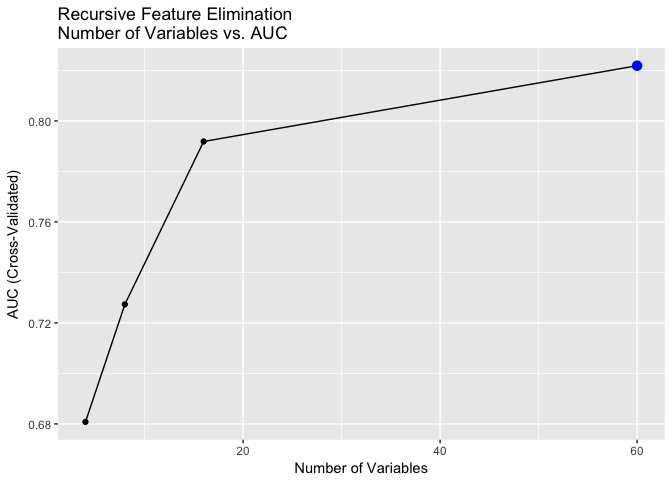
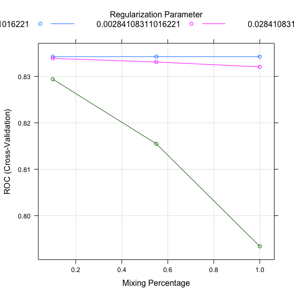
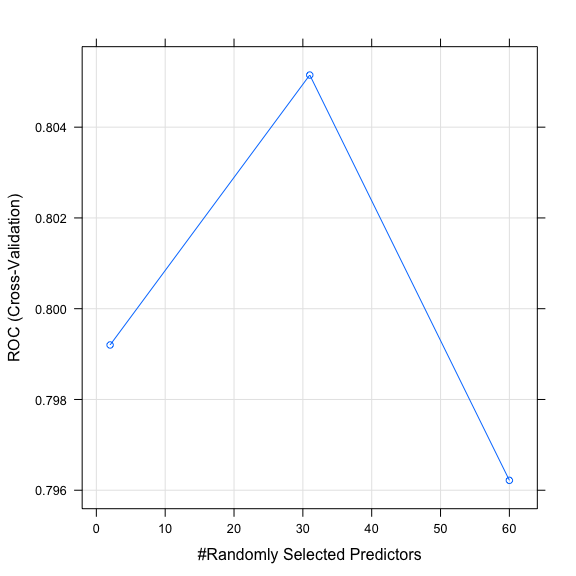

MSE 246 Data Cleaning
================
Samuel Hansen
1/21/2017

-   [Overview](#overview)
-   [Feature Engineering](#feature-engineering)
-   [Data Splitting](#data-splitting)
-   [Data Preprocessing](#data-preprocessing)
-   [Feature Selection](#feature-selection)
-   [Model Fitting](#model-fitting)
    -   [Elastic Net](#elastic-net)
    -   [Random Forest](#random-forest)

Overview
========

This script builds predictive models of small-business defaults using data spanning 1990-2014 provided by the Small Business Association (SBA). To do so, this script implements a pipeline that:

1.  Performs feature engineering;
2.  Splits the data into train and test sets;
3.  Normalizes continuous features;
4.  Selects features using recursive feature elimination;
5.  Trains binary outcome predictive models, including LASSO and random forests.

Lastly, we evaluate the performance of these models on the held-out test set in terms of AUC, sensitivity, and calibration.

``` r
# Initialize libraries and input files 
library(ggrepel)
library(knitr)
library(lubridate)
library(caret)
library(stringr)
library(tidyverse)
file_in <- "../data/SBA_Loan_data_2.csv"

# Read in data 
df <- 
  read_csv(file_in) %>%
  plyr::rename(replace = c("2DigitNAICS" = "NAICS")) %>%
  mutate(ApprovalDate = mdy(ApprovalDate))
```

Feature Engineering
===================

We engineered the following features from the raw data:

-   `first_zip_digit`: the first digit of the borrower's zip code;
-   `2DigitNAICS`: the first two digits of the NAICS code;
-   `subpgmdesc`: condensed infrequent factor levels into "other" category;
-   `approval_year`: extracted year from loan approval datetime object;
-   `term_divisibility`: encodes whether the loan term is divisible by 2.

``` r
df <- 
  df %>%
  mutate(
    # Extract first digit of zip code
    first_zip_digit = str_sub(BorrZip, end = 1), 
         
    # Encode rare subprograms as "Other"
    subpgmdesc = if_else(subpgmdesc == "Delta" | subpgmdesc == "Refinance",
                              "Other", subpgmdesc),
         
    # Extract approval year
    approval_year = year(ApprovalDate),
         
    # Encode whether loan term is even 
    term_divisibility = if_else(TermInMonths %% 2 == 0, "Even", "Odd"),
    
    # Encode Charge-off as "1"; otherwise as "0"
    LoanStatus = if_else(LoanStatus == "CHGOFF", "default", "paid")
    ) %>%
  
  # Convert features to factors 
  dmap_at(c("NAICS", "DeliveryMethod", "approval_year", "LoanStatus"), as.factor) %>%
  
  # Drop unneeded features
  select(-c(ApprovalDate, BorrZip, DeliveryMethod, ChargeOffDate, GrossChargeOffAmount))
```

Data Splitting
==============

We randomly partition the data into 70% training and 30% test sets. This approach does not implement a time-based split, but rather a random sampling of observations over the entire 1990-2014 window.

``` r
# Split data into train and validation sets 
percent_in_train <- 0.7
train_indices <- sample(nrow(df), size = percent_in_train*nrow(df))
train <- df[train_indices, ]
test <- df[-train_indices, ]
```

Data Preprocessing
==================

Some variables are on different scales; for example, `Gross Approval` varies in dollar amounts from $30,000 to $4,000,000, whereas `Term in Months` ranges from 1 to 389. In turn, we center and scale the predictors to apply regularization techniques during the modeling phase.

``` r
# Define pre-processing steps to apply to training data
preProcessSteps <- c("center", "scale")

# Apply same pre-processing steps to the test set
preProcessObject <- preProcess(train, method = preProcessSteps)
train <- predict(preProcessObject, train)
test <- predict(preProcessObject, test)
```

Feature Selection
=================

We perform feature selection using recursive feature elimination with 10-fold cross-validation. This method uses the `rfFuncs` parameter, which uses random forests to remove variables with low variable importance.

``` r
# Set the recursive feature elimination parameters 
set.seed(1234)
rfFuncs$summary <- twoClassSummary
rfe.cntrl <- rfeControl(functions = rfFuncs,
                      method = "cv",
                      number = 5,
                      returnResamp = "final")
train.cntrl <- trainControl(selectionFunction = "oneSE",
                            classProbs = TRUE,
                            summaryFunction = twoClassSummary)

# Perform recursive feature elimination to select variables
rfe.results <-
  rfe(LoanStatus~.,
      data = train,
      rfeControl = rfe.cntrl,
      preProc = preProcessSteps,
      metric = "ROC",
      trControl = train.cntrl)
```

The following table shows that recursive feature selection chooses 60 variables to include in subsequent model building.

``` r
print(rfe.results)
```

    ## 
    ## Recursive feature selection
    ## 
    ## Outer resampling method: Cross-Validated (5 fold) 
    ## 
    ## Resampling performance over subset size:
    ## 
    ##  Variables    ROC   Sens   Spec    ROCSD   SensSD   SpecSD Selected
    ##          4 0.6808 0.9431 0.4091 0.008976 0.001802 0.008720         
    ##          8 0.7273 0.9534 0.3621 0.028523 0.009528 0.035838         
    ##         16 0.7918 0.9578 0.3653 0.007996 0.002345 0.007991         
    ##         60 0.8219 0.9628 0.3607 0.005836 0.002881 0.005959        *
    ## 
    ## The top 5 variables (out of 60):
    ##    approval_year2007, approval_year2006, approval_year2008, first_zip_digit3, GrossApproval

The procedure selects 60 variables because AUC is maximized (see plot below):

``` r
ggplot(rfe.results) +
  labs(x = "Number of Variables",
       y = "AUC (Cross-Validated)",
       title = "Recursive Feature Elimination\nNumber of Variables vs. AUC")
```



The importances of the top 30 selected features are given by:

``` r
data_frame(predictor = rownames(varImp(rfe.results)), 
           var_imp = varImp(rfe.results)$Overall) %>%
  slice(1:30) %>%
  ggplot(mapping = aes(x = reorder(predictor, var_imp), y = var_imp)) +
  geom_bar(stat = "identity") +
  coord_flip() +
  labs(x = "", y = "Variable Importance", 
       title = "Recursive Feature Elimination Variable Importance")
```


``` r
# Map factor levels back to their respective features 
(selected_vars <- map(predictors(rfe.results), ~str_match(.x, names(df))) %>% 
  unlist() %>% 
  .[!is.na(.)] %>%
  unique())
```

    ##  [1] "approval_year"              "first_zip_digit"           
    ##  [3] "GrossApproval"              "NAICS"                     
    ##  [5] "ThirdPartyDollars"          "ThirdPartyLender"          
    ##  [7] "TermInMonths"               "BusinessType"              
    ##  [9] "SameLendingState"           "subpgmdesc"                
    ## [11] "MultiTimeBorrower"          "DummyNAICS"                
    ## [13] "SameThirdPartyLendingState" "term_divisibility"

``` r
train_selected_vars <- train %>%
  select(one_of(selected_vars), LoanStatus)
```

Model Fitting
=============

Using these selected features, we fit models predicting the binary outcome of whether a small busniess defaults on a loan. To tune hyperparameters, we use 10-fold cross-validation with the one standard-error rule, which selects parameters that obtain the highest cross-validated AUC within one standard error of the maximum.

``` r
# Define cross-validation controls 
cvCtrl <- trainControl(method = "cv", 
                       number = 10,
                       summaryFunction = twoClassSummary, 
                       selectionFunction = "oneSE",
                       classProbs = TRUE)
```

Elastic Net
-----------

We fit an elastic net model as follows:

``` r
# Fit penalized logistic regression model (elastic net)
elastic.fit <- train(LoanStatus ~ .,
                   data = train_selected_vars,
                   preProc = preProcessSteps,
                   method = "glmnet",
                   family = "binomial",
                   trControl = cvCtrl,
                   metric = "ROC")
```

The elastic net model was selected with the following hyperparameters:

    ## glmnet 
    ## 
    ## 38364 samples
    ##    14 predictor
    ##     2 classes: 'default', 'paid' 
    ## 
    ## Pre-processing: centered (60), scaled (60) 
    ## Resampling: Cross-Validated (10 fold) 
    ## Summary of sample sizes: 34527, 34528, 34527, 34527, 34528, 34528, ... 
    ## Resampling results across tuning parameters:
    ## 
    ##   alpha  lambda        ROC        Sens        Spec     
    ##   0.10   0.0002841083  0.8342497  0.36266848  0.9554863
    ##   0.10   0.0028410831  0.8338825  0.35821342  0.9564838
    ##   0.10   0.0284108311  0.8293940  0.27944012  0.9701060
    ##   0.55   0.0002841083  0.8342606  0.36298695  0.9554863
    ##   0.55   0.0028410831  0.8330921  0.35391659  0.9571072
    ##   0.55   0.0284108311  0.8154765  0.19828360  0.9791771
    ##   1.00   0.0002841083  0.8342559  0.36298720  0.9555175
    ##   1.00   0.0028410831  0.8320455  0.34659428  0.9579177
    ##   1.00   0.0284108311  0.7933869  0.07606301  0.9941085
    ## 
    ## ROC was used to select the optimal model using  the one SE rule.
    ## The final values used for the model were alpha = 0.1 and lambda
    ##  = 0.002841083.



Random Forest
-------------

We fit a random forest model as follows:

``` r
# Fit penalized logistic regression model (elastic net)
rf.fit <- train(LoanStatus ~ .,
                   data = train_selected_vars,
                   preProc = preProcessSteps,
                   method = "rf",
                   trControl = cvCtrl,
                   metric = "ROC")
```

The random forestmodel was selected with the following hyperparameters:

    ## Random Forest 
    ## 
    ## 38364 samples
    ##    14 predictor
    ##     2 classes: 'default', 'paid' 
    ## 
    ## Pre-processing: centered (60), scaled (60) 
    ## Resampling: Cross-Validated (10 fold) 
    ## Summary of sample sizes: 34527, 34528, 34528, 34528, 34528, 34528, ... 
    ## Resampling results across tuning parameters:
    ## 
    ##   mtry  ROC        Sens        Spec     
    ##    2    0.7992008  0.02211806  0.9990960
    ##   31    0.8051484  0.36728656  0.9415835
    ##   60    0.7962180  0.37317373  0.9321696
    ## 
    ## ROC was used to select the optimal model using  the one SE rule.
    ## The final value used for the model was mtry = 31.


