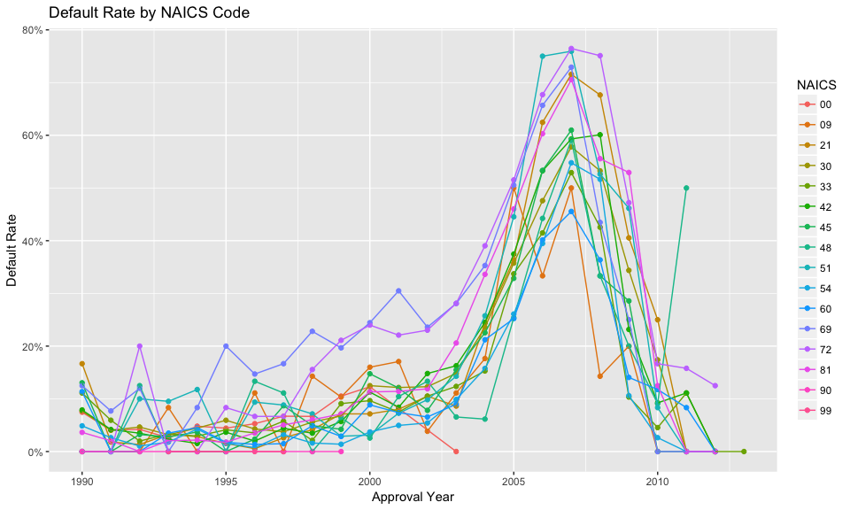
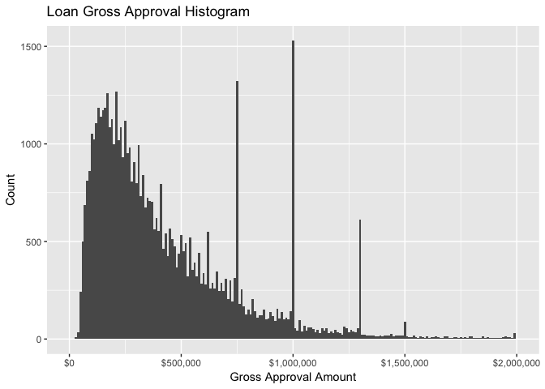
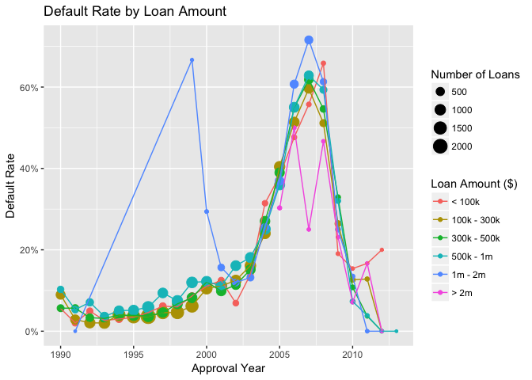

MSE 246 Data Summary
================
Samuel Hansen
1/16/2017

``` r
# Initialize libraries and input files 
library(knitr)
library(lubridate)
library(tidyverse)
file_in <- "../data/SBA_Loan_data_1.csv"
```

``` r
# Read in data 
df <- 
  read_csv(file_in) %>%
  plyr::rename(replace = c("2DigitNAICS" = "NAICS")) %>%
  mutate(ApprovalDate = mdy(ApprovalDate))
```

Fraction of Defaulted Loans
===========================

``` r
kable(
  df %>%
  count(LoanStatus) %>%
  mutate(proportion = n/sum(n))
)
```

| LoanStatus |      n|  proportion|
|:-----------|------:|-----------:|
| CHGOFF     |   8982|   0.1638872|
| PIF        |  45824|   0.8361128|

NAICS Code
==========

Default Rate by NAICS Code
--------------------------

``` r
df %>%
  group_by(NAICS, year = year(ApprovalDate)) %>%
  summarise(default_rate = mean(LoanStatus == "CHGOFF")) %>%
  ggplot(mapping = aes(x = year, y = default_rate, color = NAICS)) +
  geom_point() +
  geom_line() +
  scale_y_continuous(labels = scales::percent) +
  labs(x = "Approval Year", y = "Default Rate", title = "Default Rate by NAICS Code")
```



Loan Amount
===========

Loan Amount Histogram
---------------------

``` r
df %>%
  ggplot(mapping = aes(x = GrossApproval)) +
  geom_histogram(binwidth = 10000) +
  scale_x_continuous(labels = scales::dollar, limits = c(0,2000000)) +
  labs(x = "Gross Approval Amount", y = "Count",
       title = "Loan Gross Approval Histogram")
```



Default Rate by Loan Amount
---------------------------

``` r
loan_labels <- c("(-10,1e+05]" = "< 100k",
                 "(1e+05,3e+05]" = "100k - 300k",
                 "(3e+05,5e+05]" = "300k - 500k",
                 "(5e+05,1e+06]" = "500k - 1m",
                 "(1e+06,2e+06]" = "1m - 2m",
                 "(2e+06,4e+06]" = "> 2m")
df %>%
  mutate(#loan_bin = cut_width(GrossApproval, width = 1000000),
         loan_bin = cut(GrossApproval, breaks = c(-10, 100000, 300000, 
                                                  500000, 1000000,2000000, 4000000)),
         loan_bin = plyr::revalue(loan_bin, loan_labels),
         year = year(ApprovalDate)) %>%
  
  group_by(loan_bin, year) %>%
  summarise(count = n(),
            frac_defaulted = mean(LoanStatus == "CHGOFF")) %>%
  ggplot(mapping = aes(x = year, y = frac_defaulted, color = loan_bin)) +
  geom_point(mapping = aes(size = count)) +
  geom_line() +
  scale_y_continuous(labels = scales::percent) +
  scale_size_continuous(name = "Number of Loans") + 
  scale_color_discrete(name = "Loan Amount ($)") + 
  labs(x = "Approval Year", y = "Default Rate", title = "Default Rate by Loan Amount")
```



``` r
# EXTRA CODE SNIPPETS 
         # loan_bin = ifelse(GrossApproval <= 50000, "<= 50k",
         #                   ifelse(GrossApproval <= 100000, "<= 100k", 
         #                          ifelse(GrossApproval <= 250000, "<= 250k",
         #                                 ifelse(GrossApproval <= 500000, "<= 500k",
         #                                        ifelse(GrossApproval <= 1000000, "<= 1m",
         #                                               ifelse(GrossApproval > 1000000, ">1m", "NA"))))))
```
