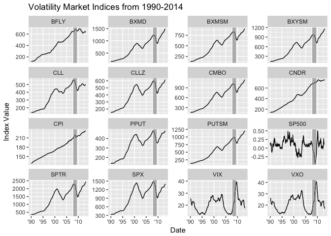
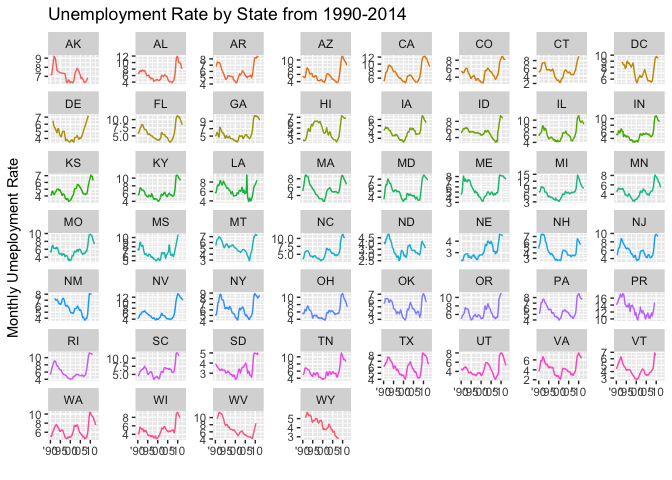

# External Data Analysis
Samuel Hansen  
3/15/2017  


```r
# Initialize libraries 
library(lubridate)
library(scales)
library(tidyverse)

# Read in data
df = read_rds("../data/merged.rds") %>%
  plyr::rename(replace = c("cpi" = "CPI"))
```

#Volatility Indices by Date

The Great Recession officially began in December 2007 and ended in June 2009. 


```r
df %>%
  gather(market, value, c(SP500, CPI, BXMSM:PPUT)) %>%
  distinct(month = month(ApprovalDate), year = year(ApprovalDate), market, value) %>%
  mutate(date = ISOdate(year, month, 1)) %>%
  dmap_at("date", as.Date) %>%
  ggplot(mapping = aes(x = date, value)) +
  geom_line() +
  geom_rect(
    aes(xmin = as.Date('2007-12-01'), 
        xmax = as.Date('2009-06-01'), 
        ymin = -Inf, 
        ymax = Inf), 
        alpha = 0.01,
    fill = 'grey') +
  facet_wrap(~market, scales = "free_y") + 
  scale_x_date(date_labels = "'%y") + 
  labs(x = "Date", 
       y = "Index Value",
       title = "Volatility Market Indices from 1990-2014")
```

<!-- -->

#State Unemployment Rates by Date


```r
df %>%
  distinct(month = month(ApprovalDate), 
           year = year(ApprovalDate), 
           BorrState, 
           unemploy_rate) %>%
  mutate(date = ISOdate(year, month, 1)) %>%
  dmap_at("date", as.Date) %>%
  ggplot(mapping = aes(x = date, y = unemploy_rate, color = BorrState)) +
  geom_line() +
  scale_x_date(date_labels = "'%y") + 
  scale_color_discrete(guide = FALSE) +
  scale_y_continuous(labels = comma) + 
  facet_wrap(~BorrState, scales = "free_y") +
  labs(x = "",
       y = "Monthly Umeployment Rate",
       title = "Unemployment Rate by State from 1990-2014")
```

<!-- -->

