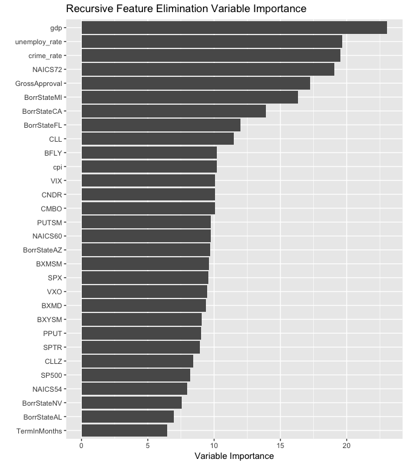
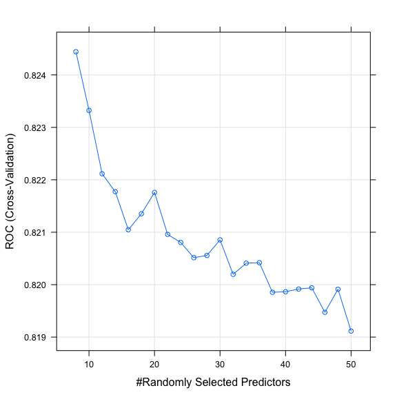
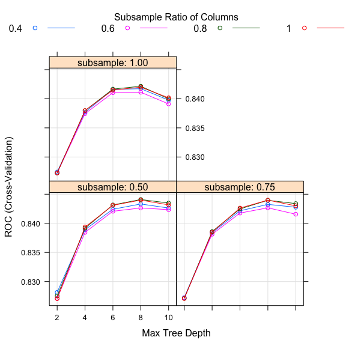
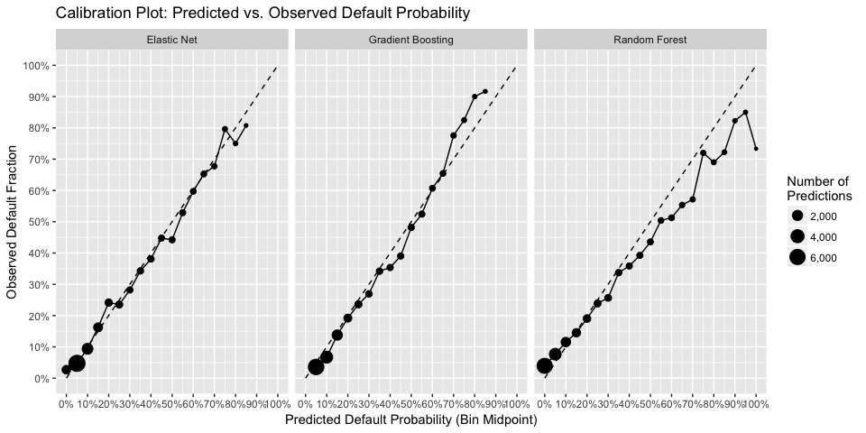

# MSE 246 Modeling Fitting
Samuel Hansen  
1/21/2017  


#Overview

This script builds predictive models of small-business defaults using 
data spanning 1990-2014 provided by the Small Business Association (SBA). 
To do so, this script implements a pipeline that:

1. Performs feature engineering;
2. Splits the data into train and test sets;
3. Normalizes continuous features;
4. Selects features using recursive feature elimination;
5. Trains binary outcome predictive models, including LASSO and random 
forests. 

Lastly, we evaluate the performance of these models on resampled partitions 
of the training data, and on a held-out test set in terms of AUC, sensitivity, 
and calibration. 


```r
# Initialize libraries 
library(ggrepel)
library(knitr)
library(lubridate)
library(caret)
library(stringr)
library(plotROC)
library(pROC)
library(tidyverse)

# Initialize input files 
train_file_in <- "../data/train.rds"
test_file_in <- "../data/test.rds"

# Read in data 
train <- read_rds(train_file_in)
test <- read_rds(test_file_in)
```

#Feature Engineering

We engineered the following features from the raw data: 

- `first_zip_digit`: the first digit of the borrower's zip code;
- `NAICS`: the first two digits of the NAICS code;
- `subpgmdesc`: condensed infrequent factor levels into "other" category;
- `approval_year`: extracted year from loan approval datetime object.

#Data Preprocessing

Some variables are on different scales; for example, `Gross Approval` 
varies in dollar amounts from \$30,000  to \$4,000,000, whereas 
`Term in Months` ranges from 1 to 389. In turn, we center and scale the 
predictors to apply regularization techniques during the modeling phase. 


```r
# Remove unnecesary features for modeling 
train <- train %>% select(-c(GrossChargeOffAmount, ChargeOffDate, 
                             ApprovalDate, first_zip_digit))
test <- test %>% select(-c(GrossChargeOffAmount, ChargeOffDate, 
                           ApprovalDate, first_zip_digit))
```


```r
# Define pre-processing steps to apply to training data
# preProcessSteps <- c("center", "scale") "pca"? 
preProcessSteps <- c("center", "scale", "nzv")

# Apply same pre-processing steps to the test set
preProcessObject <- preProcess(train, method = preProcessSteps)
train <- predict(preProcessObject, train)
test <- predict(preProcessObject, test)
```

#Feature Selection

We perform feature selection using recursive feature elimination
with 10-fold cross-validation. This method uses the 
`rfFuncs` parameter, which uses random forests to remove 
variables with low variable importance.


```r
# Set the recursive feature elimination parameters 
set.seed(1234)
rfFuncs$summary <- twoClassSummary
rfe.cntrl <- rfeControl(functions = rfFuncs,
                      method = "cv",
                      number = 5,
                      returnResamp = "final")
train.cntrl <- trainControl(selectionFunction = "oneSE",
                            classProbs = TRUE,
                            summaryFunction = twoClassSummary)

# Perform recursive feature elimination to select variables
rfe.results <-
  rfe(LoanStatus~.,
      data = train,
      rfeControl = rfe.cntrl,
      preProc = preProcessSteps,
      sizes =  seq(12,132,5),
      metric = "ROC",
      trControl = train.cntrl)

# write_rds(rfe.results, "../models/rfe.results.rds")
```


The following table shows that recursive feature selection 
chooses 122
variables to include in subsequent model building.

```r
print(rfe.results)
```

```
## 
## Recursive feature selection
## 
## Outer resampling method: Cross-Validated (5 fold) 
## 
## Resampling performance over subset size:
## 
##  Variables    ROC   Sens   Spec    ROCSD   SensSD   SpecSD Selected
##         12 0.8174 0.3784 0.9546 0.007601 0.007451 0.006651         
##         17 0.8146 0.3792 0.9488 0.007526 0.006261 0.004895         
##         22 0.8157 0.3702 0.9524 0.008222 0.005317 0.003840         
##         27 0.8152 0.3727 0.9524 0.007754 0.003174 0.004128         
##         32 0.8184 0.3716 0.9547 0.007426 0.005133 0.004497         
##         37 0.8209 0.3832 0.9532 0.007922 0.008265 0.003901         
##         42 0.8234 0.3843 0.9536 0.007943 0.008163 0.004325         
##         47 0.8248 0.3834 0.9547 0.008027 0.004722 0.004363         
##         52 0.8258 0.3811 0.9546 0.006506 0.006436 0.003054         
##         57 0.8254 0.3829 0.9549 0.006583 0.003862 0.003334         
##         62 0.8269 0.3824 0.9558 0.006721 0.002812 0.002341         
##         67 0.8254 0.3862 0.9544 0.006791 0.002709 0.003146         
##         72 0.8258 0.3880 0.9551 0.006411 0.004998 0.003334         
##         77 0.8271 0.3866 0.9557 0.006805 0.007923 0.003349         
##         82 0.8263 0.3877 0.9555 0.007001 0.007971 0.003375         
##         87 0.8265 0.3867 0.9557 0.006615 0.005873 0.002451         
##         92 0.8277 0.3897 0.9561 0.006590 0.010287 0.003127         
##         97 0.8280 0.3880 0.9563 0.006634 0.006873 0.003737         
##        102 0.8272 0.3905 0.9553 0.006709 0.007782 0.004311         
##        107 0.8273 0.3886 0.9554 0.006184 0.009188 0.003516         
##        112 0.8288 0.3901 0.9556 0.006549 0.010406 0.003523         
##        117 0.8287 0.3921 0.9560 0.006542 0.007928 0.003490         
##        122 0.8293 0.3902 0.9559 0.006742 0.010055 0.003538        *
## 
## The top 5 variables (out of 122):
##    gdp, unemploy_rate, crime_rate, NAICS72, GrossApproval
```

The procedure selects 122 
variables because AUC is maximized (see plot below):

```r
ggplot(rfe.results) +
  labs(x = "Number of Variables",
       y = "AUC (Cross-Validated)",
       title = "Recursive Feature Elimination\nNumber of Variables vs. AUC")
```

<!-- -->

The importances of the top 30 selected features are given by:

```r
data_frame(predictor = rownames(varImp(rfe.results)), 
           var_imp = varImp(rfe.results)$Overall) %>%
  slice(1:30) %>%
  ggplot(mapping = aes(x = reorder(predictor, var_imp), y = var_imp)) +
  geom_bar(stat = "identity") +
  coord_flip() +
  labs(x = "", 
       y = "Variable Importance", 
       title = "Recursive Feature Elimination Variable Importance")
```

<!-- -->


```r
# Map factor levels back to their respective features 
(selected_vars <- map(predictors(rfe.results), ~str_match(.x, names(train))) %>% 
  unlist() %>% 
  .[!is.na(.)] %>%
  unique())
```

```
##  [1] "gdp"               "unemploy_rate"     "crime_rate"       
##  [4] "NAICS"             "GrossApproval"     "BorrState"        
##  [7] "CLL"               "cpi"               "BFLY"             
## [10] "VIX"               "CNDR"              "CMBO"             
## [13] "PUTSM"             "BXMSM"             "SPX"              
## [16] "VXO"               "BXMD"              "BXYSM"            
## [19] "PPUT"              "SPTR"              "CLLZ"             
## [22] "SP500"             "TermInMonths"      "subpgmdesc"       
## [25] "BusinessType"      "SameLendingState"  "FiscalYear"       
## [28] "ThirdPartyDollars" "SameBusinessState" "MultiTimeBorrower"
## [31] "DummyNAICS"        "ThirdPartyLender"
```

```r
train_selected_vars <- train %>%
  select(one_of(selected_vars), LoanStatus)
```

#Model Fitting 

Using these selected features, we fit models predicting the binary outcome
of whether a small busniess defaults on a loan. To tune hyperparameters,
we use 10-fold cross-validation with the one standard-error rule, which selects
parameters that obtain the highest cross-validated AUC within one standard error
of the maximum. 


```r
# Define cross-validation controls 
cvCtrl <- trainControl(method = "cv", 
                       number = 10,
                       summaryFunction = twoClassSummary, 
                       selectionFunction = "oneSE",
                       classProbs = TRUE)
                       # allowParallel = TRUE)
```

##Elastic Net

We fit an elastic net model as follows:


```r
# # Define grid of tuning parameters
elasticGrid <- expand.grid(.alpha = seq(0, 1, 0.1),
                         .lambda = seq(0, 0.05, by = 0.005))

# Fit penalized logistic regression model (elastic net)
set.seed(1234)
elastic.fit <- train(LoanStatus ~ .,
                   data = train_selected_vars,
                   preProc = preProcessSteps,
                   method = "glmnet",
                   tuneGrid = elasticGrid, 
                   family = "binomial",
                   trControl = cvCtrl,
                   metric = "ROC")
```

AUC was used to select the optimal elastic net model using the one SE rule.
The final values used for the model were alpha = 0.1 and lambda = 0.

<!-- -->

##Random Forest

We fit a random forest model as follows:

```r
# # Define tuning paramter grid
rfGrid <- expand.grid(.mtry = seq(8,50,2))

# Fit penalized logistic regression model (elastic net)
set.seed(1234)
rf.fit <- train(LoanStatus ~ .,
                   data = train_selected_vars,
                   preProc = preProcessSteps,
                   method = "rf",
                   tuneGrid = rfGrid, 
                   trControl = cvCtrl,
                   metric = "ROC")
```

AUC was used to select the optimal random forest model using the one SE rule.
The final value used for the model was `mtry` = 8.
<!-- -->


```r
##Support Vector Machine 
# We fit a support vector machine with a linear kernel as follows:

# Define tuning parameter grid 
svmGrid <- expand.grid(.C = seq(0.001, 1.001, 0.1))

# Fit support vector machine with linear kernel
set.seed(1234)
svm.fit <- train(LoanStatus ~ .,
                   data = train_selected_vars,
                   preProc = preProcessSteps,
                   method = "svmLinear",
                   tuneGrid = svmGrid,
                   trControl = cvCtrl,
                   metric = "ROC",
                   verbose = TRUE)
```

##Gradient Boosting Machine


```r
# Define tuning parameter grid 
ntrees = 100
xgbGrid <- expand.grid(.nrounds = ntrees,
                       .eta = 3/ntrees,
                       .max_depth = c(2,4,6,8,10),
                       .subsample = c(0.5, 0.75, 1), 
                       .colsample_bytree = c(0.4, 0.6, 0.8, 1),
                       .gamma = 0, 
                       .min_child_weight = 1
                        )
# Fit gradient boosting machine 
set.seed(1234)
xgb.fit <-
  train(LoanStatus ~ .,
        data = train_selected_vars,
        preProc = preProcessSteps,
        method = "xgbTree",
        trControl = cvCtrl,
        tuneGrid = xgbGrid,
        metric = "ROC",
        nthread = 4
    )
```

AUC was used to select the optimal extreme gradient boosting model using 
the one SE rule. The final values used for the model were `nrounds` = 100, 
`max_depth` = 6, `eta` = 0.03, `gamma` = 0, `colsample_bytree` = 0.4, 
`min_child_weight` = 1 and `subsample` = 0.5. 

<!-- -->
#Model Evaluation 

##In-Sample Evaluation 

###Training AUC and Sensitivity of Best Models 

The following plot compares averaged **training** area under the ROC curve 
and sensitivity across the model types with optimized parameters.


```r
# Evaluate performance of each model on training data
bind_rows(getTrainPerf(elastic.fit), 
          getTrainPerf(rf.fit),
          getTrainPerf(xgb.fit)) %>% 
  as_data_frame() %>%
  mutate(method = recode(method, 
                         "glmnet" = "Elastic Net", 
                         "rf" = "Random Forest",
                         "xgbTree" = "Gradient Boosting")) %>%
  ggplot(mapping = aes(x = TrainSens, y = TrainROC, label = method)) +
  geom_point() +
  geom_text_repel() +
  labs(x = "Train Sensitivity", y = "Train AUC", 
       title = "Training Sensitivity vs. AUC by Model Type")
```

<!-- -->

###Distribution of Resampled Training AUC, Sensitivity, and Specificity 

To examine the spread of **training** area under the ROC curve,
sensitivity, and specificity across model types, we leverage the resampled
data generated during the cross-valiation of modeling fitting to plot 
their respective distributions.  


```r
# Generate resamples from data 
resamps <- resamples(list(Elastic_Net = elastic.fit,
                          Random_Forest = rf.fit,
                          Gradient_Boosting = xgb.fit))

# Generate boxplots 
metric_labs = c("ROC" = "AUC", "Sens" = "Sensitivity", "Spec" = "Specificity")
resamps$values %>%
  gather(method, value, `Elastic_Net~ROC`:`Gradient_Boosting~Spec`) %>%
  separate(method, c("method", "metric"), sep = "~", remove = TRUE) %>%
  ggplot(mapping = aes(x = method, y = value)) +
  geom_boxplot() +
  facet_wrap(~metric, scales = "free_y", 
             labeller = labeller(metric = metric_labs)) +
  labs(x = "Model Type", y = "Metric Value", 
       title = "Spread of Training AUC, Sensitivity, and Specificity") +
  theme(axis.text.x=element_text(angle = 45, hjust = 1))
```

<!-- -->

###Training ROC Curves 

Lastly, we can examine the training ROC curves by model type. 


```r
# Evaluate performance of trained models on training set 
trainResults <- data.frame(true_value = train$LoanStatus)
trainResults$randomForest <- predict(rf.fit, train, type = "prob")[,"default"]
trainResults$elasticNet <- predict(elastic.fit, train, type = "prob")[,"default"]
trainResults$gradientBoosting <- predict(xgb.fit, train, type = "prob")[,"default"]

# Compute AUC by model type 
aucs <-
  data_frame(randomForest = pROC::auc(roc(predictor = trainResults$randomForest,
                       response = trainResults$true_value)),
             elasticNet = pROC::auc(roc(predictor = trainResults$elasticNet,
                       response = trainResults$true_value)),
             gradientBoosting = pROC::auc(roc(predictor = trainResults$gradientBoosting,
                       response = trainResults$true_value))) %>%
  gather(method, auc_value, randomForest:gradientBoosting) %>%
  mutate(auc_label = paste("AUC =", round(auc_value, 3)))

# Gather results in long format 
trainResults <- 
  trainResults %>%
  gather(method, predicted_prob, randomForest:gradientBoosting) %>%
  mutate(true_value = ifelse(true_value == "default", 1, 0))

# Plot ROC curves by model type 
model_labels <- c("randomForest" = "Random Forest",
                  "elasticNet" = "Elastic Net",
                  "gradientBoosting" = "Gradient Boosting")
trainResults %>%
  ggplot(mapping = aes(d = true_value, m = predicted_prob)) +
  geom_roc(n.cuts = 5, labelsize = 2, labelround = 3) +
  annotate(geom = "segment", x = 0, xend = 1, y = 0, yend = 1,
           color = "black", linetype = 2) +
  labs(x = "False Positive Fraction", y = "True Positive Fraction",
       title = "ROC Curves by Model Type") +
  facet_wrap(~method, labeller = labeller(method = model_labels)) +
  geom_text(data = aucs, aes(x = 0.75, y = 0.5, label = auc_label), 
                    colour = "black", inherit.aes = FALSE, parse = FALSE)
```

<!-- -->

##Out-of-Sample Evaluation 

###Test ROC Curves 


```r
# Evaluate performance of trained models on test set 
testResults <- data.frame(true_value = test$LoanStatus)
testResults$randomForest <- predict(rf.fit, test, type = "prob")[,"default"]
testResults$elasticNet <- predict(elastic.fit, test, type = "prob")[,"default"]
testResults$gradientBoosting <- predict(xgb.fit, test, type = "prob")[,"default"]

# Compute AUC by model type 
aucs <-
  data_frame(randomForest = pROC::auc(roc(predictor = testResults$randomForest,
                       response = testResults$true_value)),
             elasticNet = pROC::auc(roc(predictor = testResults$elasticNet,
                       response = testResults$true_value)),
             gradientBoosting = pROC::auc(roc(predictor = testResults$gradientBoosting,
                       response = testResults$true_value))) %>%
  gather(method, auc_value, randomForest:gradientBoosting) %>%
  mutate(auc_label = paste("AUC =", round(auc_value, 3)))

# Gather results in long format 
testResults <- 
  testResults %>%
  gather(method, predicted_prob, randomForest:gradientBoosting) %>%
  mutate(true_value = ifelse(true_value == "default", 1, 0))
```


```r
# Plot ROC curves by model type 
model_labels <- c("randomForest" = "Random Forest",
                  "elasticNet" = "Elastic Net",
                  "gradientBoosting" = "Gradient Boosting")
testResults %>%
  ggplot(mapping = aes(d = true_value, m = predicted_prob)) +
  geom_roc(n.cuts = 5, labelsize = 2, labelround = 3) +
  annotate(geom = "segment", x = 0, xend = 1, y = 0, yend = 1,
           color = "black", linetype = 2) +
  labs(x = "False Positive Fraction", y = "True Positive Fraction",
       title = "ROC Curves by Model Type") +
  facet_wrap(~method, labeller = labeller(method = model_labels)) +
  geom_text(data = aucs, aes(x = 0.75, y = 0.5, label = auc_label), 
                    colour = "black", inherit.aes = FALSE, parse = FALSE)
```

<!-- -->

###Test Calibration Plots

The following calibration plots depict the extent to which our models' 
predicted probabilities of default align with the actual probabilities of
default. 


```r
# Make calibration plots, facetted by model type

# FIX LABELS HERE 
pred_prob_midpoints <- data_frame(midpoint = c(0, 0, rep(seq(0.05, 0.875, 0.05), each = 3), 0.9, 0.95, 1))
# pred_prob_midpoints <- data_frame(midpoint = rep(seq(0.025, 0.875, 0.05), each = 3))

testResults %>%
  mutate(prob_bin = cut_width(predicted_prob, width = 0.05)) %>%
  group_by(prob_bin, method) %>%
  dplyr::summarise(prob_default = mean(true_value, na.rm = TRUE),
            n = n()) %>%
  bind_cols(., pred_prob_midpoints) %>%
  ungroup() %>%
  ggplot(mapping = aes(x = midpoint, y = prob_default)) +
  geom_line() +
  geom_point(mapping = aes(size = n)) +
  # geom_text_repel(mapping = aes(color = "red")) +
  annotate(geom = "segment", x = 0, xend = 1, y = 0, yend = 1,
           color = "black", linetype = 2) +
  scale_x_continuous(labels = scales::percent,
                     breaks = seq(0, 1, by = 0.1)) +
  scale_y_continuous(labels = scales::percent,
                     breaks = seq(0, 1, by = 0.1)) +
  scale_colour_discrete(guide = FALSE) +
  scale_size(name = "Number of\nPredictions",
             labels = scales::comma) +
  labs(x = "Predicted Default Probability (Bin Midpoint)",
       y = "Observed Default Fraction",
       title = "Calibration Plot: Predicted vs. Observed Default Probability") +
  facet_wrap(~method, labeller = labeller(method = model_labels))
```

<!-- -->


